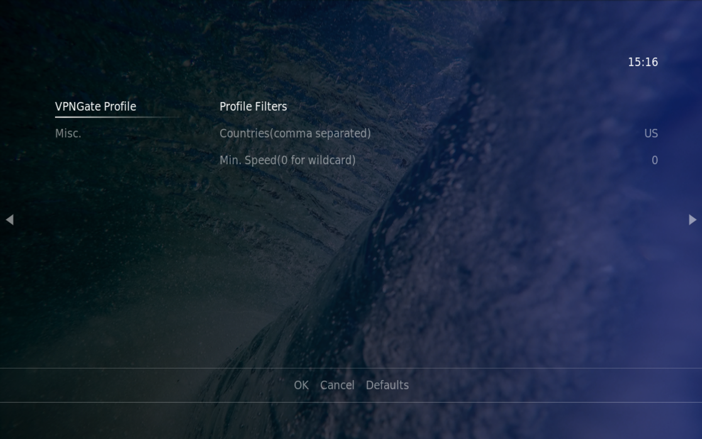

VPN Profile Downloader for kodi
==========
A script that downloads OpenVPN profiles from vpngate

## How to install
Download [the latest package](https://github.com/Thunderbird2086/script.vpngate-profile-downloader/releases) and install from zip.

## How to use
By default, profiles are downloaded to `VPN` under user home directory. A user can change it to any existing directory.

There are two filters for profile, and it can ben changed in `Setting`.
* Countries: ISO 3166-2 country code such as DE, GB, and/or US. 
* Min. Speed: Minimum throughput in Mbps

Once profiles are downloaded, you can use it for any OpenVPN addon. 

## Screen shots

